# Wheelchair IMU Angular Profiling

[](https://github.com/FabianNanaAlfaro/wheelchair-imu-angular-profiling/actions/workflows/ci.yml)
[](CHANGELOG.md)
[](LICENSE)

Public protocol and reproducibility companion for the analysis of right-upper-limb motion during self-propelled manual-wheelchair propulsion. The workflow combines synchronized videogrammetry/Kinovea support with iSen inertial-sensor exports, signal conditioning, device-defined angular descriptors, phase normalization, and descriptive summaries.

> **Release status — v1.1.2**
>
> This is a versioned companion release for the associated research study. It documents the engineering workflow and safe public examples; it does not publish private recordings or consent material.

> **Video access.** The source videos are intentionally not uploaded to GitHub. For a scientifically justified, controlled-access request, contact [Fabian A. Ñaña](mailto:fabian.nana@pucp.edu.pe). Any access remains subject to participant consent, ethics requirements, and the research team's review.

## Repository scope

This repository documents the broader experimental and computational workflow developed during the wheelchair IMU study. It includes study documentation, de-identified research materials, analysis utilities, supporting video-review tools, legacy/development code, and a tested public reference implementation. Individual components are documented according to their intended role; not every implementation represents the same analytical configuration.

## Manuscript-related analysis

For the processing configuration and analytical scope associated with the manuscript, see [`docs/manuscript_analysis.md`](docs/manuscript_analysis.md). That page identifies the iSen data source, the role of synchronized video/Kinovea review, the retained-cycle workflow, and the participant-level statistical summaries.

## Acquisition protocol

These public-facing figures document the movement lane, camera arrangement, marker placement, inertial-sensor placement, and face-obscured tracking examples used in the study.

<table>
  <tr>
    <td width="50%" align="center">
      
      <br /><sub><strong>Study geometry.</strong> Delimited movement lane and camera positions.</sub>
    </td>
    <td width="50%" align="center">
      
      <br /><sub><strong>Camera setup.</strong> Frontal and sagittal views around the lane.</sub>
    </td>
  </tr>
  <tr>
    <td width="50%" align="center">
      
      <br /><sub><strong>Marker placement.</strong> Reflective landmarks used for videogrammetry.</sub>
    </td>
    <td width="50%" align="center">
      
      <br /><sub><strong>IMU placement.</strong> Sensor locations used for the inertial signal.</sub>
    </td>
  </tr>
  <tr>
    <td width="50%" align="center">
      
      <br /><sub><strong>Frontal tracking.</strong> Static, face-obscured protocol illustration.</sub>
    </td>
    <td width="50%" align="center">
      
      <br /><sub><strong>Sagittal tracking.</strong> Static, face-obscured protocol illustration.</sub>
    </td>
  </tr>
</table>

For dimensions, equipment, task repetitions, and the public/private boundary, see the [full acquisition protocol](docs/acquisition_protocol.md).

## Public materials and reproducibility scope

- the acquisition geometry and sensor-placement protocol;
- the public reference implementation and its deterministic synthetic example;
- the filtering, alignment, derivative, and phase-normalization decisions;
- de-identified iSen exports and a de-identified support workbook; and
- supporting MATLAB, Python, notebook, and Kinovea utilities retained from the wider study workflow.

The public reference implementation can be reproduced end to end with the synthetic example. De-identified analytical materials support inspection and re-use of the published workflow where the relevant files are available. Full acquisition-to-result reproduction is not claimed because source videos and other controlled study files are not distributed.

The public tree deliberately excludes source videos, exported video files, un-obscured participant photographs, consent/recruitment forms, QR codes or phone numbers, calibration artefacts, and local computer paths. Protocol figures are included only when they are suitable for public documentation. A small number of face-obscured tracking stills are retained solely as protocol illustrations; they are not source video or a results release.

## Start here

### Run the public demo

The demo creates a synthetic iSen-like trial, estimates a device-defined angle, applies a fourth-order zero-phase Butterworth low-pass filter, computes angular velocity and acceleration, normalizes propulsion and recovery to 100 points each, and writes a manifest plus summary files.

Use Python 3.10 or newer.

```powershell
python -m venv .venv
.\.venv\Scripts\Activate.ps1
python -m pip install -r requirements.txt
python scripts\run_public_demo.py
```

Outputs are written to `examples/synthetic/outputs/` and are ignored by Git. The input file in `examples/synthetic/imu_trial.csv` is generated data, not a participant record.

### Verify the release locally

```powershell
python -m unittest discover -s tests -v
python scripts\audit_public_release.py
```

The same checks run in GitHub Actions for every push and pull request.

## Workflow at a glance

```mermaid
flowchart LR
    A[Protocol setup<br/>6 m × 1.5 m lane] --> B[Frontal + sagittal video<br/>and iSen acquisition]
    B --> C[Local export<br/>CSV / Kinovea tables]
    C --> D[Time checks<br/>synchronization + QC]
    D --> E[Butterworth LPF<br/>fc 6 Hz · order 4]
    E --> F[Device-defined<br/>angular descriptor]
    F --> G[Velocity +<br/>acceleration]
    G --> H[Propulsion / recovery<br/>explicit windows]
    H --> I[100-point temporal<br/>normalization]
    I --> J[Metrics + manifest<br/>reproducible outputs]
```



The event windows remain explicit inputs because cycle-boundary review was supported by synchronized video and signal inspection. This public release does not pretend that a manual quality-control decision is an automatic detector.

## Repository map

```text
assets/
  protocol/                       Protocol figures for setup, placement, and tracking
codes/
  matlab/                         Cleaned MATLAB reference scripts
  python/                         Legacy/support utilities retained for continuity
  notebooks/                      Cleaned exploratory notebooks
data/
  iSen/                           De-identified iSen CSV exports
  profiling_data.xlsx             De-identified support workbook
docs/
  acquisition_protocol.md         Setup, equipment, and safe visual documentation
  manuscript_analysis.md          Configuration associated with the manuscript
  processing_pipeline.md          Algorithms, schemas, and parameter choices
  public_data.md                  Public data card and boundaries
examples/synthetic/
  imu_trial.csv                   Deterministic generated input
src/wheelchair_pipeline/          Tested Python reference implementation
scripts/                          Demo runner and public-release audit
tests/                            Offline smoke tests
```

## Public reference implementation

The Python package in `src/wheelchair_pipeline/` is a tested public reference implementation for transparent signal processing. The primary quantitative descriptors in the study were derived from iSen outputs. Kinovea/videogrammetry supports protocol documentation, cycle-boundary confirmation, quality control, and contextual review; it is not silently substituted for the iSen angle calculation.

The public Python implementation exposes the same engineering stages with explicit configuration:

- time is read from the exported signal and checked for monotonic sampling;
- X/Y components are low-pass filtered with a fourth-order Butterworth filter at 6 Hz;
- the relevant component can be selected by an explicit pair or by a documented keyword match;
- a neutral window defines the reference offset;
- numerical derivatives are computed against the recorded time vector;
- phase windows are normalized by interpolation to 100 points per phase;
- outputs carry a JSON manifest so parameters are inspectable after a run.

Angles are **device-defined angular descriptors**. They should not be presented as anatomically calibrated joint angles without an additional calibration and validation procedure.

The reference implementation uses a 6 Hz cutoff and explicit neutral-window alignment. The manuscript-related configuration is documented separately because processing parameters vary across workflow components according to their intended purpose.

## Public data and privacy

The current public data are de-identified iSen exports and a de-identified support workbook. Please read [`docs/public_data.md`](docs/public_data.md) before downloading or reusing them. Source-video requests are described in the contact notice at the top of this page.

## People and research context

**Authors:** Fabian A. Ñaña, Fabricio Nava, Victoria E. Abarca, and Dante A. Elias.

**Laboratory:** Laboratorio de Investigación en Biomecánica y Rehabilitación Aplicada (LIBRA), Pontificia Universidad Católica del Perú (PUCP), Lima, Peru.

**Ethics reference:** 143-2024-CEICVyT/PUCP. No consent forms or ethics documents are included in this repository.

## Citation

Use the versioned citation in [`CITATION.cff`](CITATION.cff). A compact reference is:

> Ñaña, F. A., Nava, F., Abarca, V. E., & Elias, D. A. (2026). *Wheelchair IMU Angular Profiling* (Version 1.1.2) [Code and de-identified support materials]. GitHub. https://github.com/FabianNanaAlfaro/wheelchair-imu-angular-profiling

No article DOI is asserted by this repository. Add the article DOI to a citation only when it has been formally assigned by the publisher or indexing service.

## Related documentation

- [Acquisition protocol](docs/acquisition_protocol.md)
- [Processing pipeline](docs/processing_pipeline.md)
- [Public data card](docs/public_data.md)
- [Code guide](codes/README_CODE.md)
- [Changelog](CHANGELOG.md)

## License

The MIT license applies to the code and documentation. The de-identified research data remain subject to the permissions and conditions described in [`docs/public_data.md`](docs/public_data.md).
